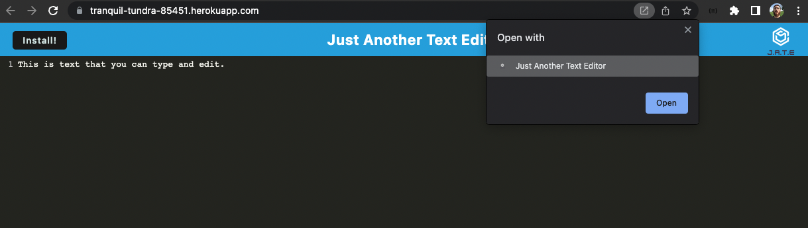

# PWA Text Editor
<p />By Michael Martens

[](https://opensource.org/licenses/MIT)

## Description
This app allows a Text Editor to be used offline in a web browser or as an installed Progressive Web Application on a mobile or desktop device.

We're compiling with Webpack and using IndexDB to store data for offline use.


<br>

## Table of Contents
[Installation](#installation)<br />[Usage](#usage)<br />[License](#license)<br />[Contributing](#contributing)<br />[Tests](#tests)<br />[Questions](#questions)

## Installation
* Clone the repo > run ```npm install``` to intialize the included dependencies
* Run ```npm run build``` to compile all front-end files into a bundle within the ```cient > dist``` folder
* Run ```npm start:dev``` to open the app locally

## Usage
The app is hosted on Heroku here: https://tranquil-tundra-85451.herokuapp.com/

## License
This project is licensed under the MIT license.

A short and simple permissive license with conditions only requiring preservation of copyright and license notices. Licensed works, modifications, and larger works may be distributed under different terms and without source code.<p />For more information visit https://choosealicense.com/licenses/mit/.

## Contributing
Other than what I learned in class, just myself! I grabbed most of my inspiration from the provided resources.

## Tests
None

## Questions
Find me on Github at https://github.com/makeithappenmike<p/>You can reach me at omichaelaaron@gmail.com if you have any questions.